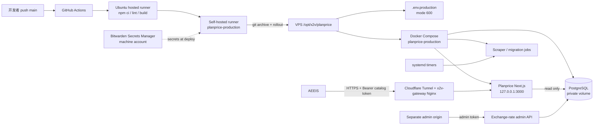

# Planprice 生产部署总图

这张图展示组件关系和发布顺序。长期生产密钥只存在 Bitwarden 和 VPS
运行时文件；GitHub Actions 只负责验证代码、发布代码和触发 VPS rollout。

## 一次发布的顺序

1. 开发者把代码推到 `main`。
2. GitHub hosted runner 执行依赖安装、lint、目录审计和 production build。
3. 通过后，GitHub 将 commit archive 交给 `planprice-production` self-hosted
   runner。
4. runner 从 Bitwarden 读取部署所需 secrets，或验证 VPS 已有的 secrets；
   它们写入 VPS 的 `deploy/production/.env.production`，权限必须是 `600`。
5. runner 在 VPS 创建隔离 release 目录，复制代码但排除旧的 env 文件，运行
   `validate:production-env` 和 `rollout.sh`。
6. `rollout.sh` 构建镜像、启动 PostgreSQL、执行迁移、启动 app，并检查
   `/api/health`。失败就停止发布，不重启共享 Gateway 或 toolkit。
7. runner 安装并重启 systemd scraper timers。
8. 发布后访问正式 `/v1/health/ready`、catalog 和 exchange-rates；AEEIS
   执行 `g3:preflight`，然后运行一次真实 Provider sandbox Run。

## 密钥放在哪里

| 内容 | Bitwarden | GitHub | VPS | 容器环境 |
|---|---:|---:|---:|---:|
| PostgreSQL 密码 | 是 | 不保存明文 | `.env.production` | app/postgres |
| catalog Bearer token | 是 | 不保存明文 | `.env.production` | app |
| exchange-rate admin key | 是 | 不保存明文 | 仅 admin origin | admin job |
| Provider API key | 是 | 不保存明文 | AEEIS/Provider secret store | AEEIS |
| `DEPLOY_PATH` | 否 | GitHub Environment Variable | — | — |

public catalog app 不得拥有 admin key。Bitwarden 读取失败、secret 缺失或仍是
`replace-*` 占位值时，部署必须失败；禁止回退到 `demo-update-key`。

## 三个边界

- **GitHub**：代码验证和发布编排，不运行生产数据库。
- **VPS**：Planprice、PostgreSQL、scraper 和运行时 secrets。
- **Gateway**：只负责 Cloudflare/Nginx 路由；Planprice 发布不能重启它。

## G3 验收证据

必须同时有以下证据才算完成：

1. GitHub Actions verify/deploy job 成功。
2. VPS rollout 输出 app health 成功，数据库迁移成功。
3. `/v1/health/ready` 返回 `ready`，带正确 Bearer 行为。
4. `/v1/catalog/models` digest 和快照有效期通过。
5. `/v1/exchange-rates` 返回新鲜 FX。
6. AEEIS `g3:preflight` 通过。
7. Provider sandbox Run 成功，并保存 Model Pin、价格证据和调用回执。
